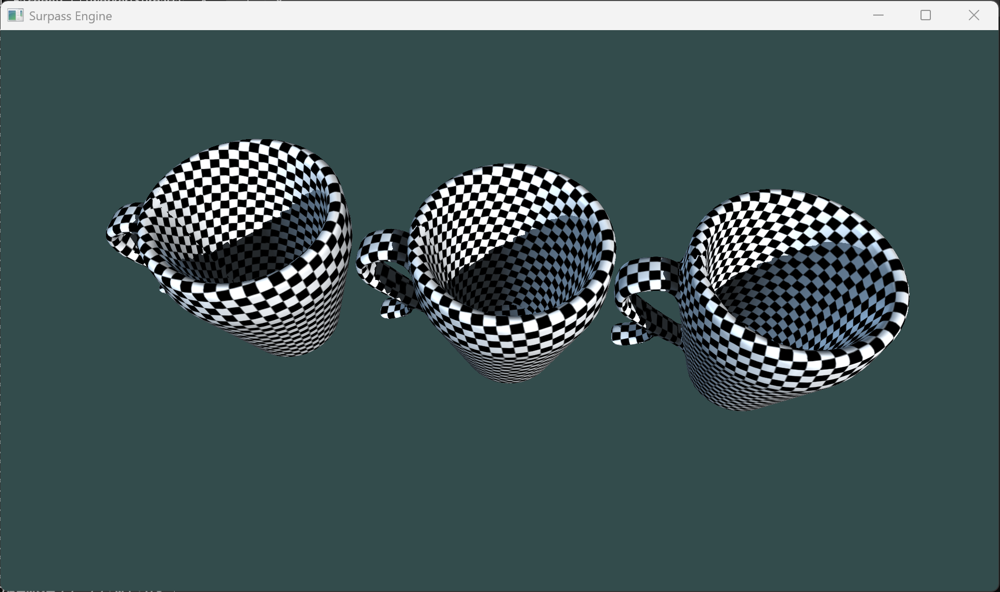

# Surpass-Core Surpass渲染内核
一个从零开始构建的 C++/OpenGL 渲染内核。

## 软件介绍
### 计划的最终效果
提供给使用者完全能跑的API接口，使用者无需理解渲染如何实现，开盒即用
同时提供便利接口，方便其他开发者修改底层渲染实现

### 版本
0.2

### 开发运行环境
**操作系统**：Windows11
**IDE**：Visual Studio 2022（Community）
**适用平台**：x64

### 使用的第三方库
```
GLFW | 3.5.1            | https://www.glfw.org/download.html
GLAD | Core Profile 4.6 |
stb  | 
glm  | 1.0.3
```

### 3D效果图


### 项目结构
```
Surpass-Core    // 项目根目录
-> bin          // 项目最终生成程序
-> bin-int      // 项目中间产物
-> lib          // 存放第三方库
---> glad
---> glfw
---> glm
---> stb
-> res          // 资产
---> models     // .obj文件
cup(lp).obj
---> picture    // 图片
---> shader     // 渲染器
---> textures   // 纹理文件
-> src          // 源代码
---> core
---> pipeline
---> renderer
---> world      // 维护数据
---> utils
-> tools        // 环境构建文件
```

### 如何快速构建项目
项目使用环境构建工具Premake，无需自行下载
进入tools文件夹，双击 build.bat
在保证终端无报错后，会在根目录生成一个.sln文件，点击即可使用

### 下一步
- 进一步使用premake管理项目
- 修改光影细节
- 实现多Pass渲染
- 添加材质

## 里程碑
- v0.1 - 实现Utils、Shader、Mesh和Window封装、引入premake项目管理和预编译头
- v0.2 - 实现Log、Camera、Renderer封装，进入3D

## 许可证

本项目采用 **Apache License 2.0** 进行开源。

你可以自由地使用、修改、分发本项目的代码，包括用于商业目的。但需保留原始版权声明，并在修改时标注变更内容。

详细的许可证条款请查看 [LICENSE](./LICENSE) 文件。

> **品牌声明**：本项目名称 "Surpass" 及 Logo 是项目的品牌标识，未经授权不得用于商业宣传或误导性用途。